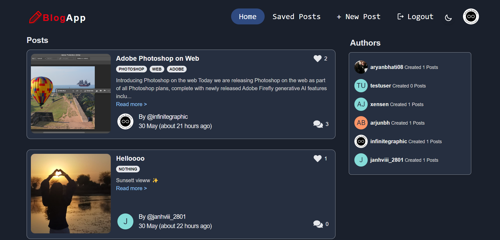

# BlogApp - Blogging Online is now much easier

Write blogs on various topics and start your journey as an impactful Content Creator, exploring your passions, sharing your knowledge and experiences with the world.

## Screenshot 📸



## Deployed Link 🌐

The website is hosted at: 👉 [BlogApp](https://blogapp07.vercel.app/)

## Table of Contents

- [Project Structure](#project-structure)
- [Technologies Used](#technologies-used-)
- [Deployed Link](#deployed-link-)
- [Description](#description-)
- [Features](#features-)
- [Screenshot](#screenshot-)
- [Getting Started](#getting-started-)
- [Usage](#usage-)
- [Contributing](#contributing-)
- [Acknowledgments](#acknowledgments-)

## Project Structure

- **index.html**: The main HTML file.
- **features**: The features folder consists all state management slices
- **main.jsx**: The JSX file consists of routing of the app
- **appwrite** : This folder consists of the api calls of appwrite to get, edit, delete posts

## Technologies Used 🛠️

- ReactJS
- Tailwind CSS
- JavaScript
- ReduxToolkit
- Zod
- Appwrite

## Libraries Used 🛠️

- react-datepicker
- react-share
- react-hook-form
- html-react-parser
- react-drop-zone
- react-icons

## Description 📝

BlogApp is a user-friendly web application that allows users to create, read, update, and delete blog posts. It provides detailed information about each blog, including the title, content, and associated tags. Users can also comment on and like blog posts, fostering a community of content creators.

## Features ✨

- User-friendly interface
- User authentication and authorization with Appwrite
- Rich text editor for writing blogs
- Responsive design for mobile and desktop
- User profile management
- Comment and like functionality

## Getting Started 🏁

To run the project locally, follow these steps:

1. Clone the repository:

```bash
git clone https://github.com/AryanBhati7/BlogApp
```

2. Navigate to the project directory:

```bash
cd BlogApp
```

3. Install the required Node modules:

```bash
npm install
```

3. Configure Appwrite using .env.sample

4. Run the client Server

```bash
npm run dev
```

5. Search this on your preferred browser :

```bash
localhost:5173
```

## Usage

1. **Sign Up or Log In**

   Create a new account or log in with an existing account.

2. **Create a Blog**

   Click on "Create New Blog" and start writing using the rich text editor. Add categories and tags to organize your blog.

3. **Manage Your Blogs**

   Edit or delete your blogs from your profile page.

4. **Engage with Content**

   Comment on and like other users' blogs to engage with the community.

## Contributing

We welcome contributions to enhance BlogApp! Please follow these steps to contribute:

1. Fork the repository.
2. Create a new branch: `git checkout -b feature/your-feature-name`.
3. Make your changes and commit them: `git commit -m 'Add some feature'`.
4. Push to the branch: `git push origin feature/your-feature-name`.
5. Submit a pull request.

## Acknowledgments

Thanks to the developers of ReactJS, Tailwind CSS, NodeJS, Express, and Appwrite for their amazing tools.
